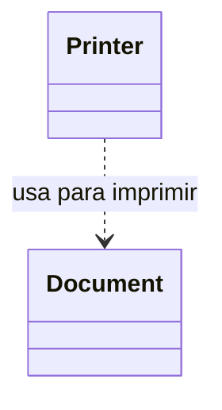
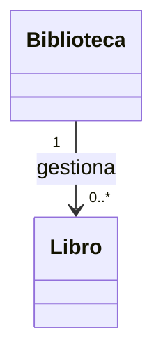
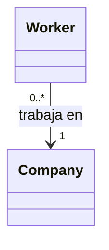
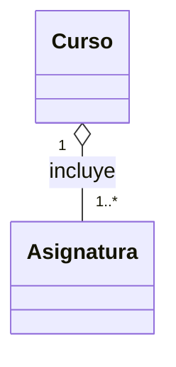
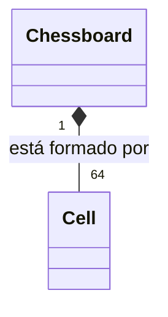
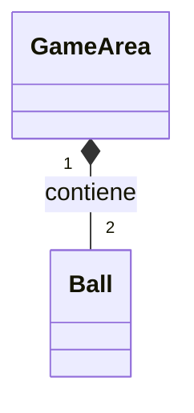
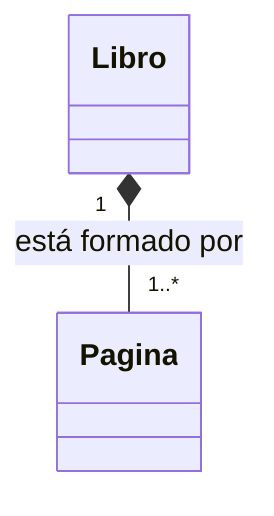
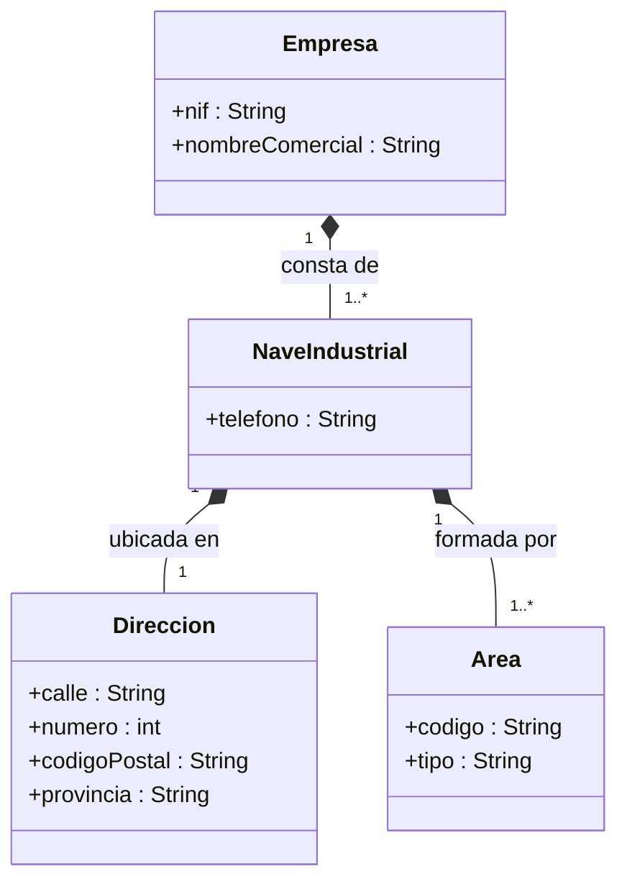

# Diagramas UML — Sesión 08

## Ejemplos trabajados en clase

### 1) Dependencia — `Printer` y `Document`

### 2) Asociación — `Biblioteca` y `Libro`

### 3) Asociación — `Worker` y `Company`

### 4) Agregación — `Curso` y `Asignatura`

### 5) Composición — `Chessboard` y `Cell`

### 6) Composición — `GameArea` y `Ball`

### 7) Composición — `Libro` y `Pagina`

## Ejercicio 1

