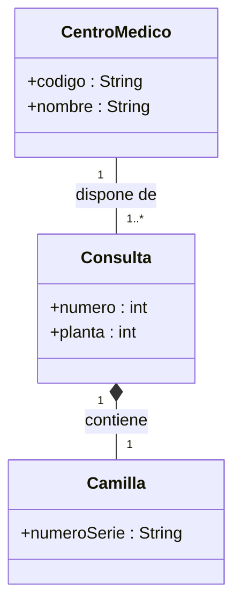
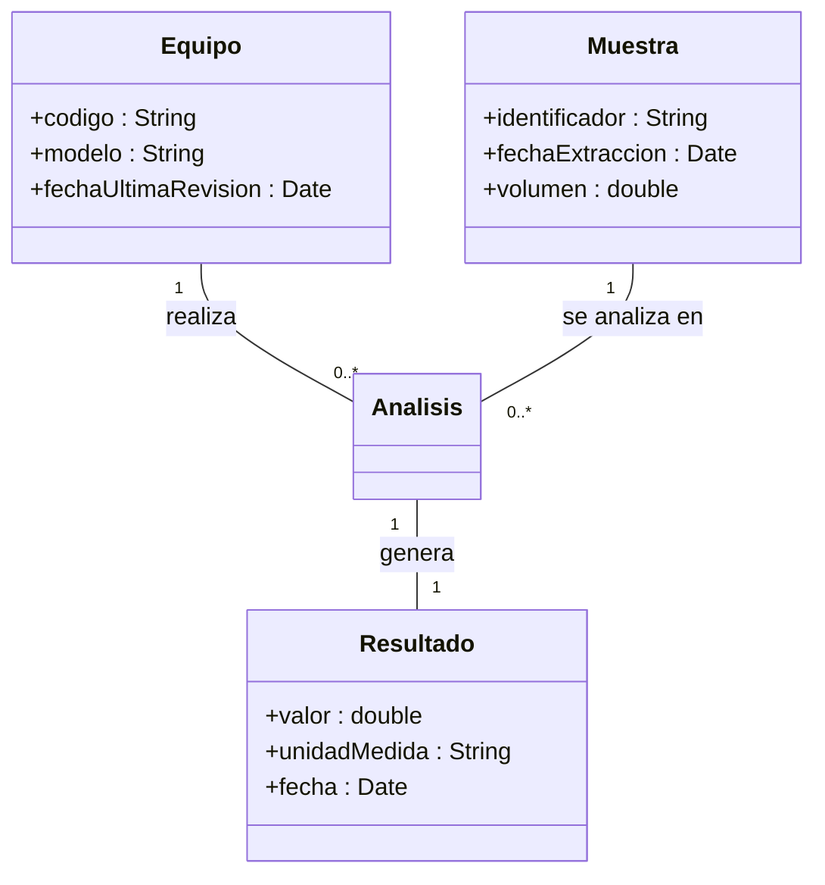
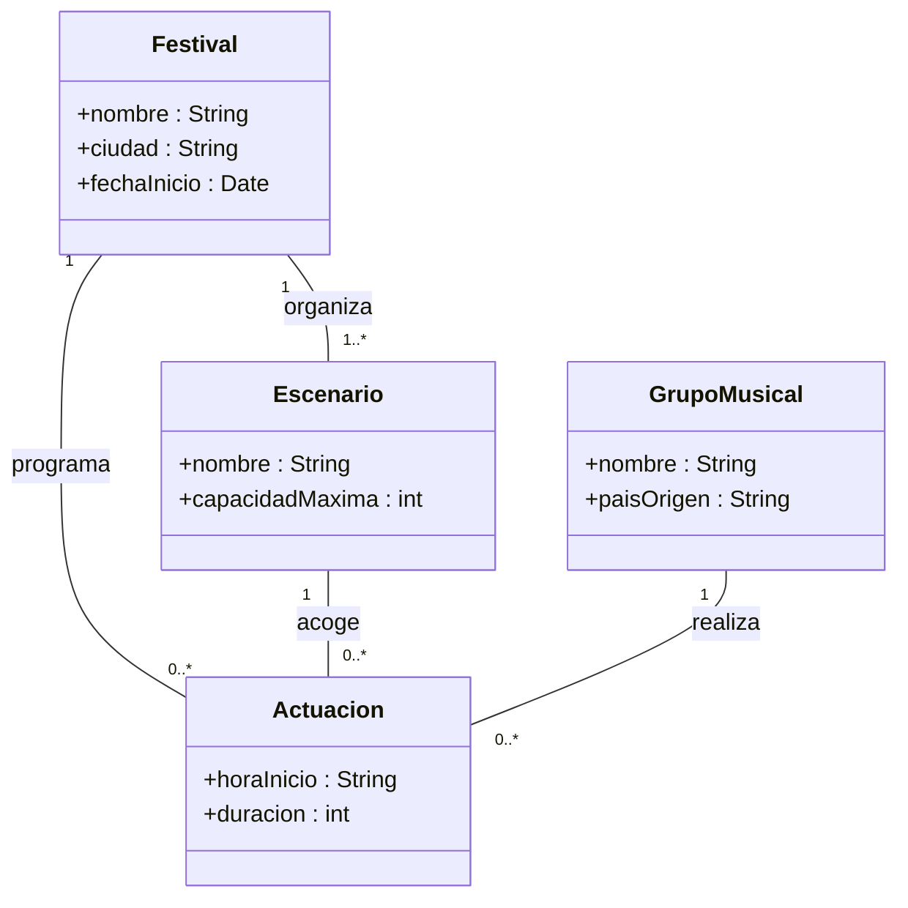
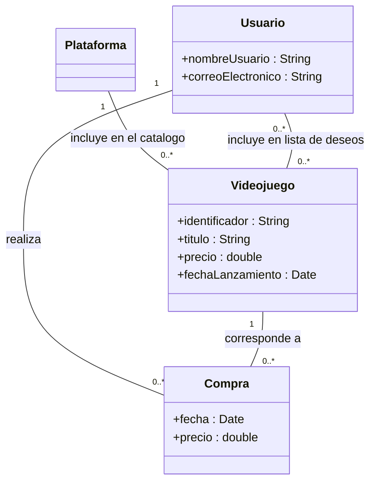
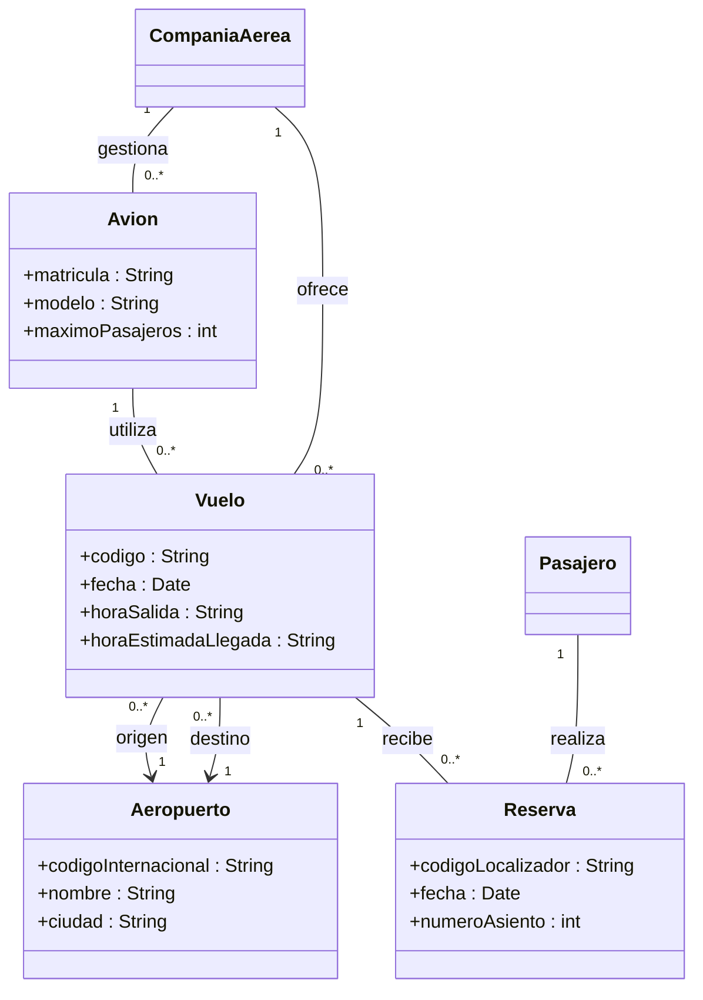

# Diagramas UML — Sesión 09

## Ejercicio 1 — Centro médico

## Ejercicio 2 — Laboratorio

## Ejercicio 3 — Festival de música

## Ejercicio 4 — Plataforma de videojuegos

## Ejercicio 6 — Compañía aérea

